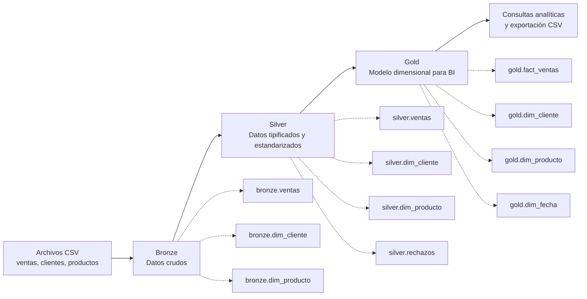

# Arquitectura Medallón

```mermaid
flowchart LR
    A[Archivos CSV<br/>ventas, clientes, productos] --> B[Bronze<br/>Datos crudos]
    B --> C[Silver<br/>Datos tipificados y estandarizados]
    C --> D[Gold<br/>Modelo dimensional para BI]
    D --> E[Consultas analíticas<br/>y exportación CSV]

    B1[bronze.ventas]
    B2[bronze.dim_cliente]
    B3[bronze.dim_producto]

    C1[silver.ventas]
    C2[silver.dim_cliente]
    C3[silver.dim_producto]
    C4[silver.rechazos]

    D1[gold.fact_ventas]
    D2[gold.dim_cliente]
    D3[gold.dim_producto]
    D4[gold.dim_fecha]

    B -.-> B1
    B -.-> B2
    B -.-> B3

    C -.-> C1
    C -.-> C2
    C -.-> C3
    C -.-> C4

    D -.-> D1
    D -.-> D2
    D -.-> D3
    D -.-> D4
```