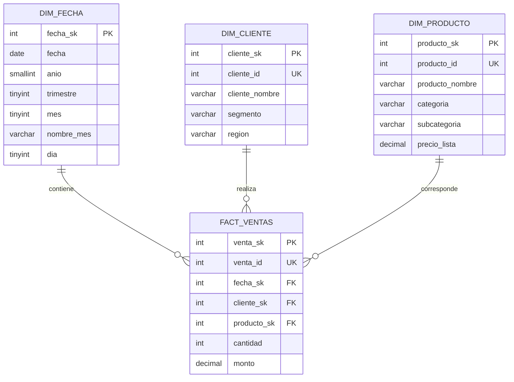

# Modelo dimensional Gold

## Granularidad

Una fila de `FACT_VENTAS` representa una venta válida identificada por `venta_id`.

## Relaciones

- `FACT_VENTAS.fecha_sk` → `DIM_FECHA.fecha_sk`.
- `FACT_VENTAS.cliente_sk` → `DIM_CLIENTE.cliente_sk`.
- `FACT_VENTAS.producto_sk` → `DIM_PRODUCTO.producto_sk`.